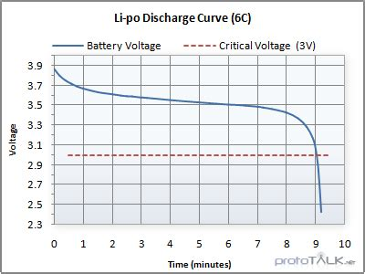

# A to D  
  
How would I set up the Arduino nano 33 BLE rev 2 to use the A to D converter to measure voltage on A0? The voltage to be measured is from a LiPo battery (3.7 VDC max) to a resistor voltage divider (the middle of two 100 K 1 % resistors in series to ground with the battery voltage applied to the top). So the measurement would be 1/2 of the battery voltage applied as it decreases as the battery discharges. The sample period is 4 times a minute.  
  
A TPS61023 Boost converter from Adafruit is converting the LiPo battery in  to 5 VDC to power a Pixel LED string. An Enable to this device will disable it when the battery is at an unsafe value. The enable pin will be D5 on the Arduino  
  
I’ve heard preventing over discharging is very important.  
Two methods to consider to improve measurement.  
  
1.  
Consider implementation with **Hysteresis.** Without hysteresis, the Arduino might see this bounce, think the battery is healthy again, and re-enable the LEDs. Consider "latch" logic: once the battery hits the **cutoff**, the boost converter stays off until the battery is significantly recharged or the system is reset.  
  
2.  
Also, the typical LiPo battery discharge could be used to predict when the discharged value is reached.   
  
  
A **Basic Linear Regression on the last 5 samples**.  
If the calculated "Time to Empty" (TTE) suddenly drops by more than 20% between samples, you can trigger a "Deviation Flag" to D5 to shut down the system before the physical cutoff is even reached.  
  
To implement a **5-sample linear regression** on your Nano 33 BLE, use the **Least Squares Method**. This will allow the Arduino to calculate the "trend line" of the battery voltage.  
By calculating the slope (m), you can predict how many minutes are left until the battery hits your cutoff voltage. It can "see" the cliff coming as the slope steepens.  
**The Predictive Formula**  
We are looking for the equation V = mt + b, where:  
**m (Slope)**: The rate of change in Volts per minute.  
**b (Intercept)**: The current theoretical voltage.  
**Time to Empty (TTE)**: Calculated as \frac{V_{cutoff} - V_{current}}{m}  
  
Which method to use? However, there may not be enough memory space in the Arduino.  
